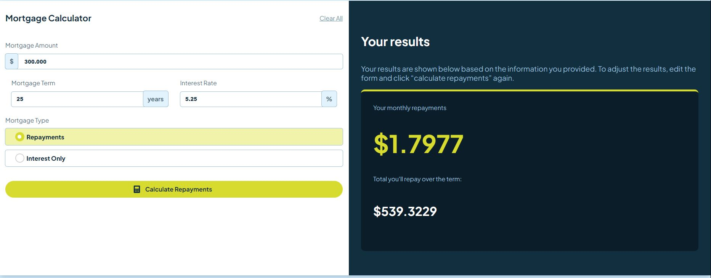
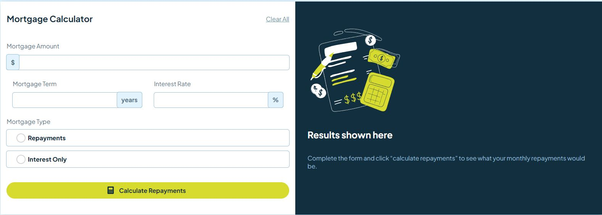
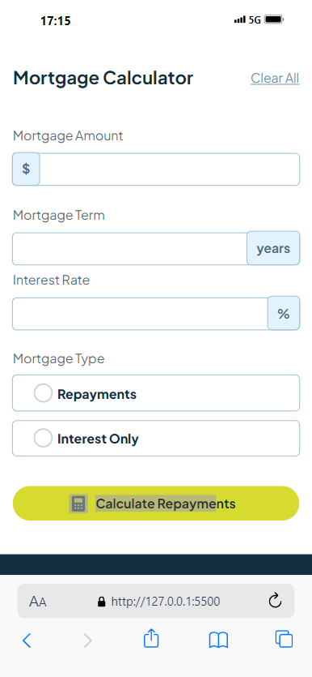
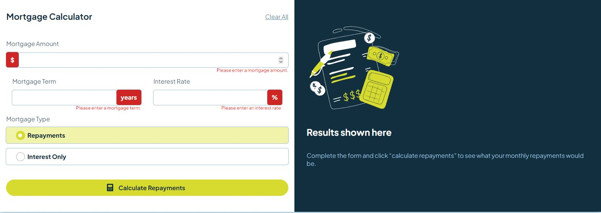
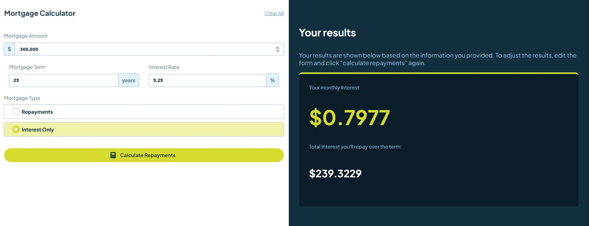
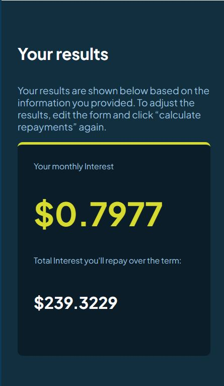

# Frontend Mentor - Mortgage repayment calculator solution

## Table of contents

- [Overview](#overview)
  - [The challenge](#the-challenge)
  - [Screenshot](#screenshot)
  - [Links](#links)
- [My process](#my-process)
  - [Built with](#built-with)
  - [What I learned](#what-i-learned)
  - [Continued development](#continued-development)
  - [Useful resources](#useful-resources)
- [Author](#author)
- [Acknowledgments](#acknowledgments)

## Overview

Your challenge is to build out this mortgage repayment calculator and get it looking as close to the design as possible.

### The challenge

Users should be able to:

- Input mortgage information and see monthly repayment and total repayment amounts after submitting the form
- See form validation messages if any field is incomplete
- Complete the form only using their keyboard
- View the optimal layout for the interface depending on their device's screen size
- See hover and focus states for all interactive elements on the page

### Screenshot

### Links

- Solution URL: [Add solution URL here](https://your-solution-url.com)
- Live Site URL: [Add live site URL here](https://your-live-site-url.com)

## My process
- Prepare The Template
- Add Custom css properties and displays
- Control the layout with Javascript as its my last step

### Built with

- Semantic HTML5 markup
- CSS custom properties
- ES6 JavaScript

### What I learned

  I've gained more in-depth knowledge in manipulating DOM and knows how mortgages are working in the world.

### Continued development

I would like to add charts , Loading logo and make it more customizable.

## Author

- Website - akchouche Mouhamed Amine(https://port-4391f.web.app/)
- Frontend Mentor - [@Mouhamed-Amine](https://www.frontendmentor.io/profile/yourusername)
- LinkedIn - (https://www.linkedin.com/in/mouhamed-amine/)

## Acknowledgments

Special Thanks to experts behind every resource i've used and for the authors of frontend Mentor who gave me this challenge to improve my skills.

